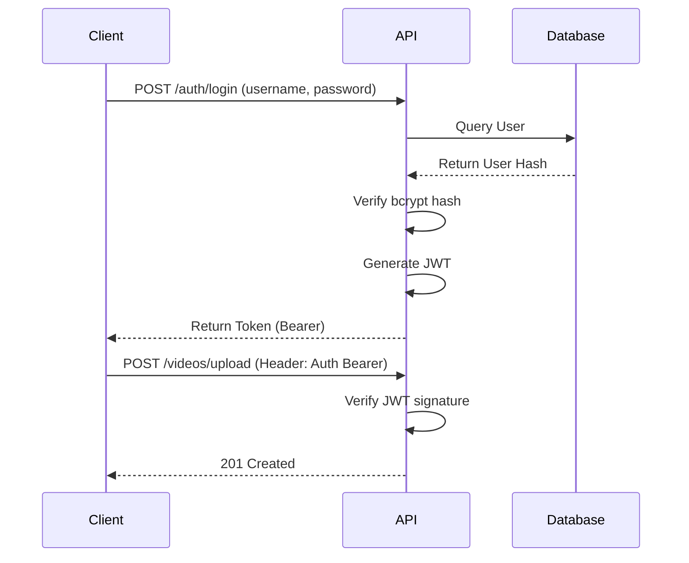

```mermaid
sequenceDiagram
    participant Client
    participant API
    participant Database

    Client->>API: POST /auth/login (username, password)
    API->>Database: Query User
    Database-->>API: Return User Hash
    API->>API: Verify bcrypt hash
    API->>API: Generate JWT
    API-->>Client: Return Token (Bearer)
    
    Client->>API: POST /videos/upload (Header: Auth Bearer)
    API->>API: Verify JWT signature
    API-->>Client: 201 Created
```
