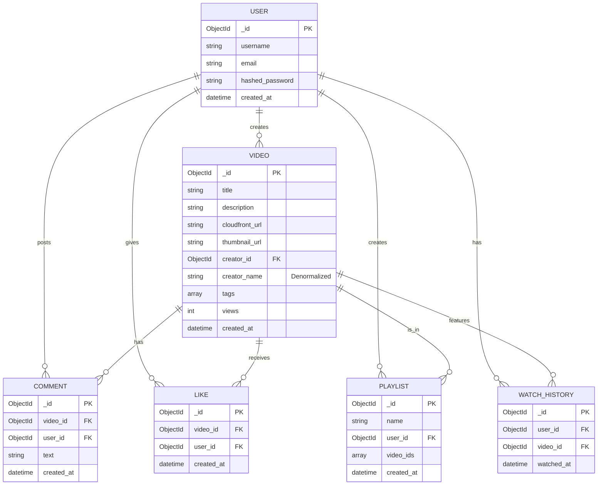

```mermaid
erDiagram
    USER {
        ObjectId _id PK
        string username
        string email
        string hashed_password
        datetime created_at
    }
    
    VIDEO {
        ObjectId _id PK
        string title
        string description
        string cloudfront_url
        string thumbnail_url
        ObjectId creator_id FK
        string creator_name "Denormalized"
        array tags
        int views
        datetime created_at
    }
    
    COMMENT {
        ObjectId _id PK
        ObjectId video_id FK
        ObjectId user_id FK
        string text
        datetime created_at
    }
    
    LIKE {
        ObjectId _id PK
        ObjectId video_id FK
        ObjectId user_id FK
        datetime created_at
    }
    
    PLAYLIST {
        ObjectId _id PK
        string name
        ObjectId user_id FK
        array video_ids
        datetime created_at
    }
    
    WATCH_HISTORY {
        ObjectId _id PK
        ObjectId user_id FK
        ObjectId video_id FK
        datetime watched_at
    }

    USER ||--o{ VIDEO : "creates"
    USER ||--o{ COMMENT : "posts"
    USER ||--o{ LIKE : "gives"
    USER ||--o{ PLAYLIST : "creates"
    USER ||--o{ WATCH_HISTORY : "has"
    VIDEO ||--o{ COMMENT : "has"
    VIDEO ||--o{ LIKE : "receives"
    VIDEO ||--o{ PLAYLIST : "is_in"
    VIDEO ||--o{ WATCH_HISTORY : "features"
```
