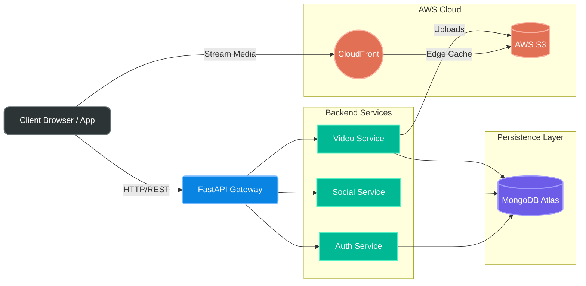

```mermaid
graph LR
    %% Custom Visual Styles
    classDef client fill:#2d3436,stroke:#636e72,stroke-width:2px,color:#fff,rx:10,ry:10;
    classDef api fill:#0984e3,stroke:#74b9ff,stroke-width:2px,color:#fff,rx:5,ry:5;
    classDef service fill:#00b894,stroke:#55efc4,stroke-width:2px,color:#fff;
    classDef db fill:#6c5ce7,stroke:#a29bfe,stroke-width:2px,color:#fff;
    classDef aws fill:#e17055,stroke:#fab1a0,stroke-width:2px,color:#fff;

    %% Nodes
    Client[Client Browser / App]:::client
    API[FastAPI Gateway]:::api
    
    subgraph Services [Backend Services]
        Auth[Auth Service]:::service
        Social[Social Service]:::service
        Video[Video Service]:::service
    end
    
    subgraph Data [Persistence Layer]
        DB[(MongoDB Atlas)]:::db
    end
    
    subgraph AWS [AWS Cloud]
        Storage[(AWS S3)]:::aws
        CDN((CloudFront)):::aws
    end

    %% Flow designed to eliminate crossing arrows (Top-to-Bottom / Left-to-Right separation)
    Client -->|Stream Media| CDN
    CDN -->|Edge Cache| Storage
    
    Client -->|HTTP/REST| API
    
    API --> Auth
    API --> Social
    API --> Video
    
    Auth --> DB
    Social --> DB
    Video --> DB
    
    Video -->|Uploads| Storage
```
