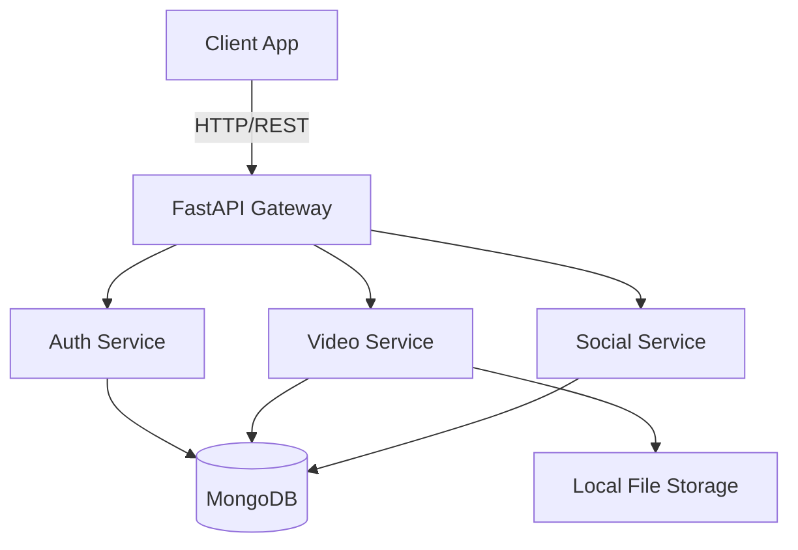

```mermaid
graph TD
    Client[Client App] -->|HTTP/REST| API[FastAPI Gateway]
    API --> Auth[Auth Service]
    API --> Video[Video Service]
    API --> Social[Social Service]
    
    Auth --> DB[(MongoDB)]
    Video --> DB
    Social --> DB
    
    Video --> Storage[Local File Storage]
```
