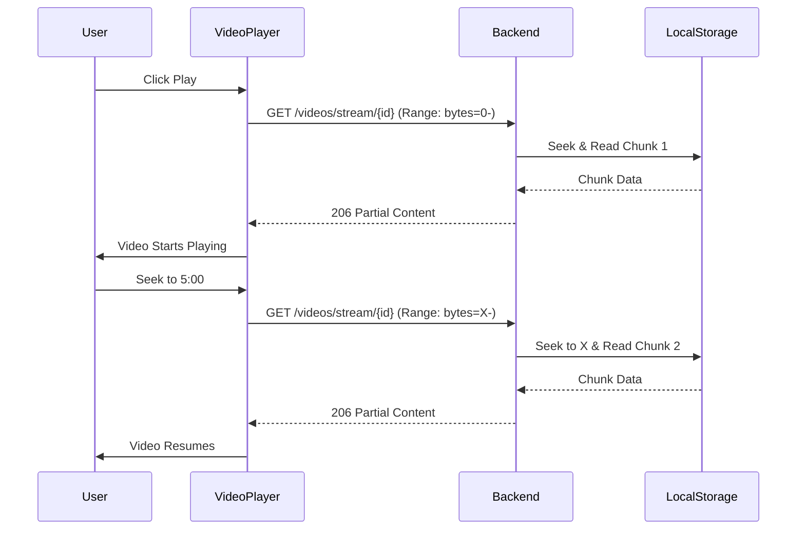

```mermaid
sequenceDiagram
    participant User
    participant VideoPlayer
    participant Backend
    participant LocalStorage

    User->>VideoPlayer: Click Play
    VideoPlayer->>Backend: GET /videos/stream/{id} (Range: bytes=0-)
    Backend->>LocalStorage: Seek & Read Chunk 1
    LocalStorage-->>Backend: Chunk Data
    Backend-->>VideoPlayer: 206 Partial Content
    VideoPlayer->>User: Video Starts Playing

    User->>VideoPlayer: Seek to 5:00
    VideoPlayer->>Backend: GET /videos/stream/{id} (Range: bytes=X-)
    Backend->>LocalStorage: Seek to X & Read Chunk 2
    LocalStorage-->>Backend: Chunk Data
    Backend-->>VideoPlayer: 206 Partial Content
    VideoPlayer->>User: Video Resumes
```
