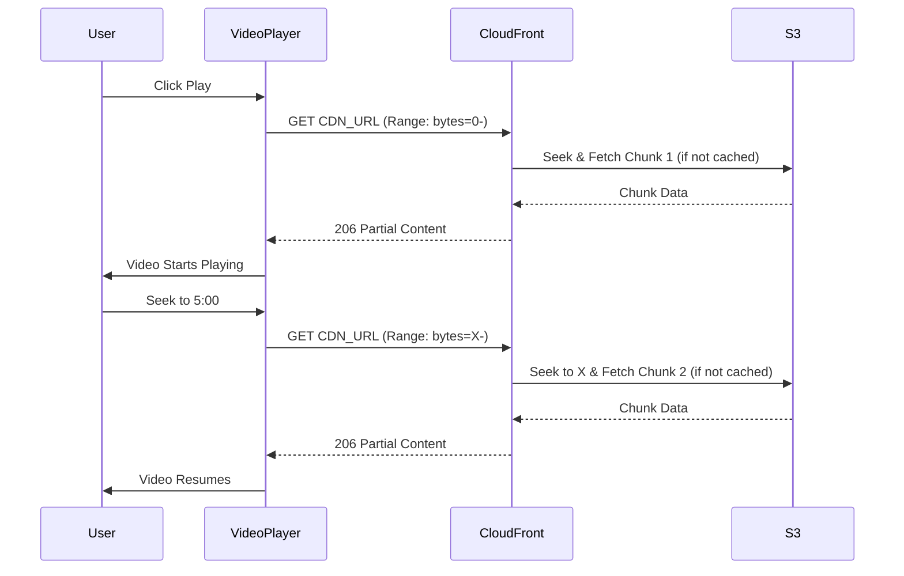

```mermaid
sequenceDiagram
    participant User
    participant VideoPlayer
    participant CloudFront
    participant S3

    User->>VideoPlayer: Click Play
    VideoPlayer->>CloudFront: GET CDN_URL (Range: bytes=0-)
    CloudFront->>S3: Seek & Fetch Chunk 1 (if not cached)
    S3-->>CloudFront: Chunk Data
    CloudFront-->>VideoPlayer: 206 Partial Content
    VideoPlayer->>User: Video Starts Playing

    User->>VideoPlayer: Seek to 5:00
    VideoPlayer->>CloudFront: GET CDN_URL (Range: bytes=X-)
    CloudFront->>S3: Seek to X & Fetch Chunk 2 (if not cached)
    S3-->>CloudFront: Chunk Data
    CloudFront-->>VideoPlayer: 206 Partial Content
    VideoPlayer->>User: Video Resumes
```
