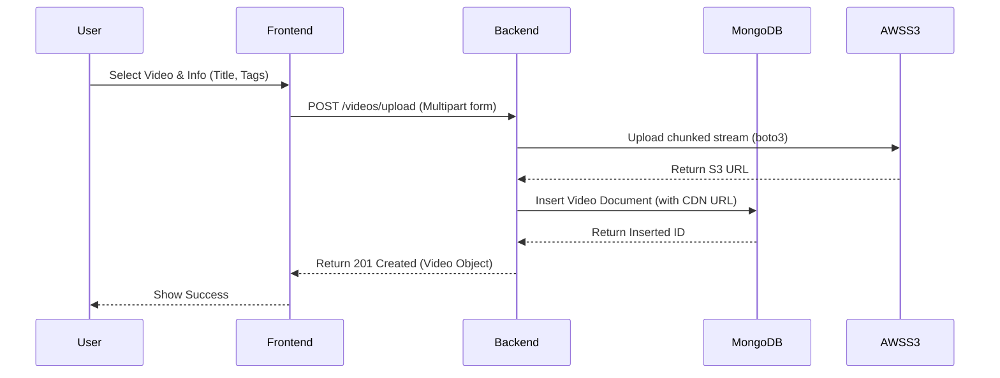

```mermaid
sequenceDiagram
    participant User
    participant Frontend
    participant Backend
    participant MongoDB
    participant AWSS3

    User->>Frontend: Select Video & Info (Title, Tags)
    Frontend->>Backend: POST /videos/upload (Multipart form)
    Backend->>AWSS3: Upload chunked stream (boto3)
    AWSS3-->>Backend: Return S3 URL
    Backend->>MongoDB: Insert Video Document (with CDN URL)
    MongoDB-->>Backend: Return Inserted ID
    Backend-->>Frontend: Return 201 Created (Video Object)
    Frontend-->>User: Show Success
```
