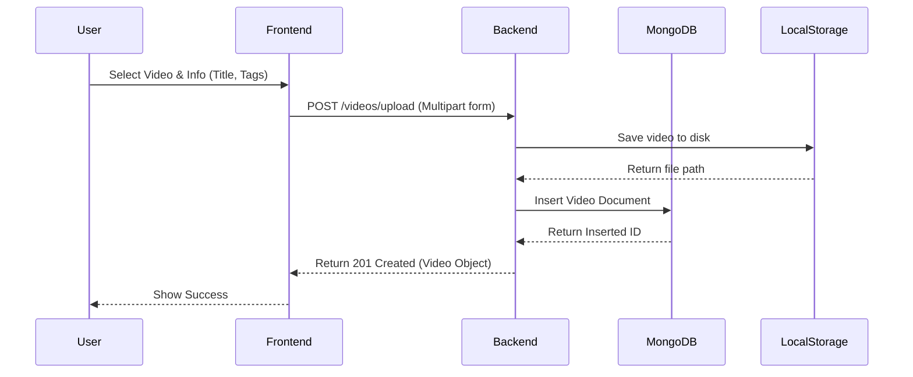

```mermaid
sequenceDiagram
    participant User
    participant Frontend
    participant Backend
    participant MongoDB
    participant LocalStorage

    User->>Frontend: Select Video & Info (Title, Tags)
    Frontend->>Backend: POST /videos/upload (Multipart form)
    Backend->>LocalStorage: Save video to disk
    LocalStorage-->>Backend: Return file path
    Backend->>MongoDB: Insert Video Document
    MongoDB-->>Backend: Return Inserted ID
    Backend-->>Frontend: Return 201 Created (Video Object)
    Frontend-->>User: Show Success
```
