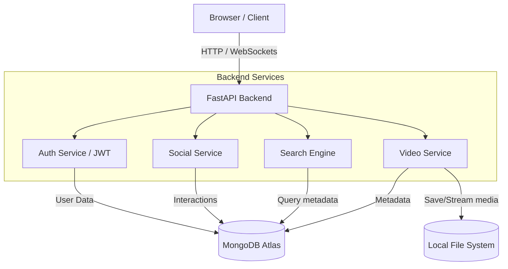

# System Architecture

This document outlines the high-level architecture and component-level interactions of the StreamTube video streaming platform.

## High-Level Architecture (3-Tier Model)

The application follows a standard **3-Tier Architecture**:
1. **Presentation Layer (Frontend)**: Native HTML5, Bootstrap 5, and Vanilla JavaScript rendered dynamically using FastAPI's Jinja2 templating engine.
2. **Application Layer (Backend)**: Python FastAPI handles all business logic, routing, authentication, and database communications asynchronously.
3. **Data Layer (Database & Storage)**: MongoDB Atlas (NoSQL) is used for flexible document storage (users, videos, likes, comments). The local server file system acts as the media storage volume.

## Component Architecture Diagram

## Detailed Technology Stack

### 1. Frontend Technologies
- **HTML5 & CSS3**: Core markup and styling.
- **Bootstrap 5**: Responsive grid framework and pre-built UI components (Modals, Dropdowns).
- **Vanilla JavaScript**: Handles asynchronous `fetch` requests for liking, commenting, searching, and uploading without requiring page reloads.
- **Jinja2**: Server-side template rendering for injecting dynamic variables (like the page title and API endpoints) directly into the HTML before serving it to the client.

### 2. Backend Technologies
- **FastAPI**: A modern, fast (high-performance) web framework for building APIs with Python 3.10+ based on standard Python type hints.
- **Uvicorn**: ASGI web server implementation for Python.
- **PyJWT**: For generating and verifying JSON Web Tokens (JWT) used in stateless authentication.
- **Passlib & bcrypt**: For secure password hashing.

### 3. Database and Storage Technologies
- **MongoDB Atlas**: Cloud-hosted NoSQL database. Documents are stored in BSON format, making it highly flexible for dynamic schemas like Video metadata.
- **Motor**: Asynchronous Python driver for MongoDB, ensuring that database I/O does not block the FastAPI event loop.
- **Local File System**: `uploads/videos/` and `uploads/thumbnails/` act as our Object Storage layer.

## Security Architecture

1. **Stateless Authentication**: Upon login, the backend signs a JWT containing the user's ID and expiration time. The frontend stores this token in `localStorage` and attaches it as a `Bearer` token in the `Authorization` header of all subsequent protected API requests.
2. **Password Hashing**: Plain text passwords are never stored. `bcrypt` salts and hashes the password before insertion into MongoDB.

## Data Flow (Video Streaming)
Streaming a video requires special handling to prevent loading a massive file entirely into the server's RAM.
- We utilize **HTTP Range Requests** (`206 Partial Content`).
- When the client's video player requests the video, it sends a `Range` header (e.g., `bytes=0-10000`).
- FastAPI reads only that specific byte range from the disk chunk and sends it back. This allows the user to scrub/seek through the video instantly.
