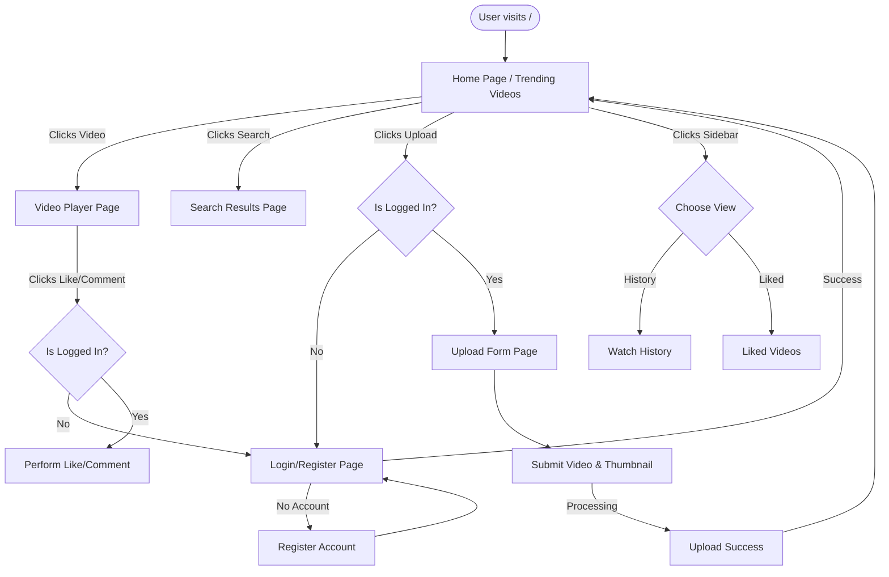

# User Flow

This document details the step-by-step journey of a user interacting with the StreamTube platform, from landing on the site to uploading their own video.

## Visual Flowchart

## Step-by-Step User Journey

### 1. Landing on the Application
- The user accesses the root URL (`/`).
- The server responds with the `index.html` template.
- The browser executes `main.js`, which fires an asynchronous request to `/videos/trending`.
- The homepage populates with video cards showing thumbnails, titles, and view counts.

### 2. Registration and Login
- If the user clicks "Sign In", they are routed to `/login`.
- The user fills out the Registration form.
- Upon success, they switch to the Login tab and submit their credentials.
- The server validates the password and returns a JWT token.
- The frontend saves this token to the browser's `localStorage` and redirects the user back to the homepage.

### 3. Watching a Video
- The user clicks on a video card.
- They are routed to `/watch/{id}`.
- The browser loads the HTML5 `<video>` tag, which is seamlessly redirected by the backend `/videos/stream/{id}` endpoint to the CloudFront CDN URL.
- As the video plays, the CloudFront CDN continuously streams chunks of the video file directly from its edge cache, bypassing the EC2 backend entirely.
- The frontend silently fires a request to `/playlists/history/{id}` to record the fact that the user watched this video.

### 4. Engaging (Liking & Commenting)
- While on the video page, the user clicks the "Like" button.
- The frontend attaches the JWT token from `localStorage` and sends a POST request.
- The server verifies the token, records the like in MongoDB, and updates the UI like count.
- The user types a comment and hits "Post". The same token validation occurs, and the comment appears instantly without a page refresh.

### 5. Managing History
- The user opens the left sidebar and clicks "Watch History".
- The frontend uses the exact same `index.html` structure but fetches data from the `/playlists/history` API endpoint instead of the trending endpoint.
- The UI renders the user's personalized history.

### 6. Uploading Content
- The user clicks the "Upload Video" button in the top navigation bar.
- They fill out the title, description, and tags, and select the `.mp4` and image files.
- The frontend packages this into a `FormData` object and POSTs it to the backend.
- The backend streams the physical files directly to AWS S3 using `boto3`, and writes the metadata document (including the CDN URL) to MongoDB.
- The user is redirected to the homepage, where their newly uploaded video is now visible.
