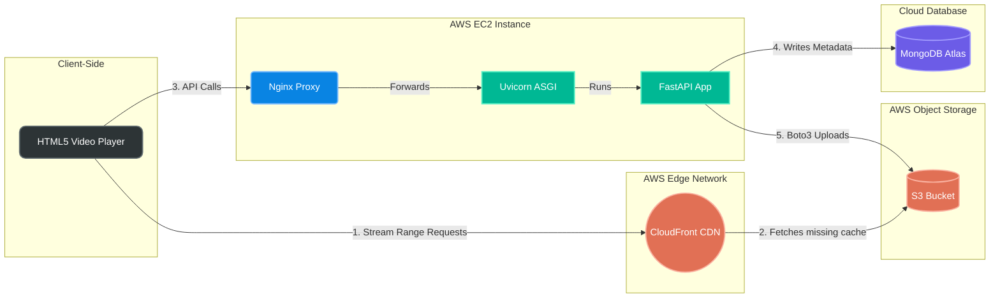

# Comprehensive Architectural Clarifications & Viva Defense Guide

This document is the ultimate technical deep-dive into the StreamTube architecture. It is designed to prepare you for your final presentation and Viva by providing exhaustive explanations of every component, accompanied by potential questions an examiner might throw at you to test your underlying knowledge.

---

## 1. Complete System Architecture Diagram

This diagram maps out exactly how the different technologies in your project interact in production.

---

## 2. Deep Dive: Component Breakdown

### A. The Presentation Layer (Frontend)
- **Vanilla JavaScript & HTML5**: We deliberately avoided heavy frontend frameworks like React or Angular to keep the system lightweight and demonstrate core DOM manipulation skills.
- **Jinja2**: Since FastAPI is handling the backend, we use Jinja2 to dynamically inject API endpoints into our HTML templates before they are served to the client. This prevents us from having to hardcode URLs.

### B. The Application Layer (EC2 Backend)
- **Nginx**: Acts as a "Reverse Proxy". When a user visits your IP address (port 80), Nginx catches the request first. It acts as a shield, preventing users from directly accessing your Python code, and forwards the safe requests to Uvicorn.
- **Uvicorn**: An ASGI (Asynchronous Server Gateway Interface) server. Traditional Python web servers can only do one thing at a time. Uvicorn allows Python to handle multiple requests concurrently using an event loop.
- **FastAPI**: The core Python framework. It handles all the business logic (routing, authentication, database querying).

### C. The Data Layer (MongoDB Atlas)
- **MongoDB**: A NoSQL database that stores data as flexible BSON (Binary JSON) documents. This is crucial for a video platform because videos can have an unpredictable number of tags, comments, or dynamically changing metadata that would require complicated, slow `JOIN` operations in a standard SQL database.
- **Motor**: The official asynchronous Python driver for MongoDB. It ensures that when FastAPI asks MongoDB for data, FastAPI doesn't freeze while waiting for the response.

### D. The Storage & Delivery Layer (AWS)
- **AWS S3**: An infinitely scalable Object Storage bucket. Instead of saving `.mp4` files to your EC2 server's hard drive (which would quickly run out of space and crash), the backend streams the files directly into S3.
- **AWS CloudFront**: A Content Delivery Network. It caches your S3 videos at "Edge Locations" all around the world. When a user hits play, the video loads from a server physically close to them, not from your EC2 instance.

---

## 3. The Video Streaming Pipeline (The "Secret Sauce")

The most complex part of a video streaming platform is ensuring the server doesn't crash when someone watches a 1GB video file. We solve this using **HTTP Range Requests**.

1. **The Request**: The HTML5 `<video>` tag natively sends a header called `Range: bytes=0-1000000`. It is basically asking, "Give me only the first 1MB of the video".
2. **The Delivery (CloudFront)**: CloudFront intercepts this request. It pulls just that 1MB chunk from its cache (or from S3 if it's not cached yet) and sends it to the user.
3. **The Status Code**: The response is sent with an HTTP **`206 Partial Content`** status code.
4. **Continuous Buffering**: As the user watches the first 1MB, the browser automatically requests the next 1MB chunk (`bytes=1000001-2000000`), allowing the video to buffer continuously without ever downloading the whole file at once.

---

## 4. Examiner VIVA Questions & Defense Guide

Here are the toughest architectural questions an examiner could ask, and exactly how to answer them to demonstrate deep technical competence.

### Q1. "Why did you choose FastAPI over a mature framework like Django?"
**Defense:** 
"A video streaming platform requires managing thousands of long-lived, concurrent connections. Django was traditionally built synchronously, meaning each connection blocks a worker thread. FastAPI is natively built on Python's `asyncio`. It uses an asynchronous event loop, allowing a single server thread to handle thousands of concurrent requests seamlessly, which is critical for a high-throughput streaming application."
**Examiner Cross-Question:** "But what if reading a video file blocks the event loop?"
**Defense:** "We use Python generators with the `yield` keyword and asynchronous file reading. The event loop is only briefly paused while reading a 1MB chunk into memory, and then yields control back so other requests can be handled concurrently."

### Q2. "Why use MongoDB instead of a Relational Database like MySQL/PostgreSQL?"
**Defense:**
"Video platforms have highly read-heavy workloads with flexible schemas. For example, a video document might contain a variable array of 'tags' or embedded metadata. In a relational database, I would need a rigid schema and expensive `JOIN` operations across multiple tables to reconstruct a video's page. MongoDB allows me to store all of this as a single, flexible JSON-like document, allowing me to retrieve everything in a single, lightning-fast disk read. Furthermore, MongoDB scales horizontally (sharding) much easier than SQL."
**Examiner Cross-Question:** "What about ACID compliance? Doesn't MongoDB lack transactions compared to SQL?"
**Defense:** "MongoDB actually supports multi-document ACID transactions since version 4.0. However, for a video platform MVP, strict ACID compliance across multiple tables is far less critical than high-speed reads and schema flexibility."

### Q3. "I see you are using AWS S3. Why didn't you just save the videos on the EC2 server's local disk?"
**Defense:**
"Saving large binary blobs to an application server's local disk is an anti-pattern for scalability. First, EC2 disk storage (EBS) is expensive and limited. If the platform grew, the disk would fill up and crash the server. Second, serving massive files consumes immense Disk I/O and network bandwidth, starving the API of resources to handle normal requests. Migrating to AWS S3 completely offloads the storage burden and allows for infinite horizontal scaling."
**Examiner Cross-Question:** "Isn't S3 expensive for outbound bandwidth? How do you manage costs?"
**Defense:** "That's exactly why we use CloudFront. Data transfer from S3 to CloudFront is free, and CloudFront's outbound data rates are generally lower than direct S3 outbound, plus it caches content to heavily reduce redundant S3 read requests."

### Q4. "What is CloudFront doing in your architecture? Isn't S3 enough?"
**Defense:**
"S3 is just storage; it is not optimized for global delivery. If an S3 bucket is in Mumbai, a user in New York will experience high latency and buffering. AWS CloudFront is a CDN (Content Delivery Network). It caches the S3 videos at global Edge Nodes. This drastically reduces the Time-To-First-Byte (TTFB) for users worldwide and reduces our S3 bandwidth costs by serving requests directly from the cache."
**Examiner Cross-Question:** "How does CloudFront know when a video is updated or deleted?"
**Defense:** "We can configure CloudFront TTL (Time To Live) settings, or issue a Cache Invalidation request from the backend to instantly clear the edge cache for a specific video URL."

### Q5. "If 1,000 users upload a video at the exact same time, what happens to your server?"
**Defense:**
"Because the backend is asynchronous, it handles concurrent uploads efficiently. We also use the `boto3` SDK to stream the upload chunks directly through the server and into AWS S3 using multipart uploads. This means the 1GB video is never fully loaded into the EC2 server's RAM; it simply passes through as a stream, preventing Out-Of-Memory (OOM) crashes."
**Examiner Cross-Question:** "What if the 1000 uploads exceed the EC2 instance's network bandwidth limit?"
**Defense:** "In a true production environment, instead of proxying uploads through EC2, we would use S3 Pre-signed URLs. The backend would generate a secure, temporary URL, and the client browser would upload the massive video directly to S3, bypassing our EC2 server entirely."

### Q6. "Why are you using JWTs instead of traditional Session Cookies?"
**Defense:**
"Traditional session cookies require the backend to maintain a state. The server has to store a session ID in its memory or a database (like Redis) and look it up on every single request. JWT (JSON Web Tokens) are stateless. The token contains the cryptographic proof of the user's identity. The backend just verifies the digital signature mathematically without needing a database lookup. This makes the API entirely stateless, meaning we could spin up 10 more EC2 instances tomorrow and put them behind a load balancer, and they would all be able to authenticate users instantly."
**Examiner Cross-Question:** "Since JWTs are stateless, how do you instantly revoke access if a user is banned?"
**Defense:** "That is the main tradeoff. Since we don't query the database, we can't instantly invalidate a token on the server side. To fix this, we keep token expiration times very short (e.g., 15 minutes) and would maintain a 'blacklist' of revoked tokens in a fast in-memory database like Redis if immediate revocation is required."

### Q7. "What happens if a user uploads a video with the same exact filename as another user?"
**Defense:**
"Before uploading the file to S3, the backend intercepts the file and generates a UUID (Universally Unique Identifier). It prepends this UUID to the filename. This guarantees absolute uniqueness across the entire S3 bucket, making name collisions mathematically impossible."
**Examiner Cross-Question:** "Why not just use the MongoDB generic ObjectId as the filename?"
**Defense:** "We absolutely could! However, using UUIDs ensures the storage layer is completely decoupled from the database layer, meaning S3 objects are unique regardless of the database engine we use."

### Q8. "What is Nginx actually doing? Why not just expose Uvicorn directly to the internet?"
**Defense:**
"Uvicorn is an excellent ASGI server for processing Python code, but it is not built to be a public-facing web server. Nginx acts as a highly optimized Reverse Proxy. It handles raw HTTP connection management, drops malformed requests, mitigates basic DDoS attacks, and serves static files incredibly fast. It acts as a hardened security shield, only passing legitimate API requests back to Uvicorn on an internal port."
**Examiner Cross-Question:** "If Nginx handles SSL/TLS termination, how does it securely communicate with Uvicorn?"
**Defense:** "Nginx decrypts the HTTPS traffic at the edge and communicates with Uvicorn over an internal, private network using plain HTTP or a Unix socket, which is extremely fast and secure because it's completely isolated from the public internet."

### Q9. "Are you using Kafka, RabbitMQ, or any message queues for comments or uploads?"
**Defense:**
"No, for this architecture's scale, we are doing direct synchronous database writes via FastAPI. When a user posts a comment, FastAPI directly inserts it into MongoDB using the asynchronous `motor` driver. While a message broker like Kafka would be necessary for a massive distributed system (like the real YouTube) to queue millions of comments per second and prevent database bottlenecks, it would introduce unnecessary complexity and infrastructure overhead for our current monolithic backend scope."
**Examiner Cross-Question:** "If you don't use Kafka, what happens if the MongoDB instance goes down during a comment spike?"
**Defense:** "Because we are doing synchronous writes, the API request would fail and return a 500 error to the user. With a queue like Kafka, the API could still accept the comment, store it in the broker, and wait for the database to recover before writing it, ensuring zero data loss. This highlights why queues are so important at a larger scale."
